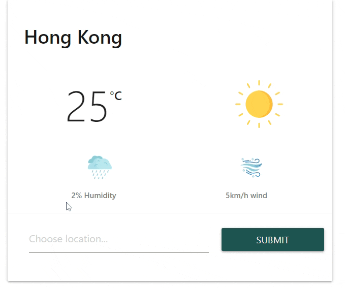

# EasyWeather
EasyWeather is a User-Friendly weather web application that provides information about current weather, wind speed and humidity.

## Installation
The application is written in native JavaScript HTML and CSS, no additional package is required. 

## Usage

Input the city you want in the search bar and press the send button:

